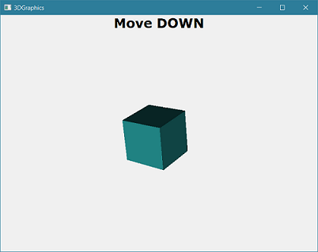
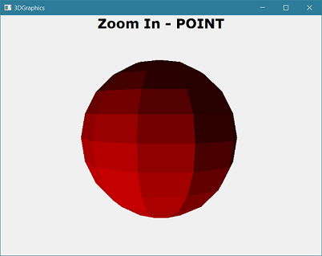

# 3DGraphicsApp

3DGraphicsApp is a C++ Framework for 3D graphic design, developed from scratch using vectors, geometry concepts, matrix based transformations and many more.

#### You can either choose a cube or a sphere from inside the app's constructor and start moving it around.

## Press following keys to:
> TRANSLATE
>
> <kbd>A</kbd> - move left  
> <kbd>S</kbd> - move down  
> <kbd>D</kbd> - move right  
> <kbd>W</kbd> - move up  

> ROTATE
>
> <kbd>▲</kbd> - Ox Rotation (Up)  
> <kbd>▼</kbd> - Ox Rotation (Down)  
> <kbd>◄</kbd> - Oy Rotation (Left)  
> <kbd>►</kbd> - Oy Rotation (Right)  
> <kbd>,</kbd> - Oz Rotation (Left)  
> <kbd>.</kbd> - Oz Rotation (Right)  

> ZOOM In/Out:
>
> <kbd>+</kbd> - Zoom In (via Origin)  
> <kbd>-</kbd> - Zoom Out (via Origin)  
> <kbd>I</kbd> - Zoom In (via Point)  
> <kbd>O</kbd> - Zoom Out (via Point)  

>SYMMETRY
>
> <kbd>1</kbd> - symmetry to xOy  
> <kbd>2</kbd> - symmetry to yOz  
> <kbd>3</kbd> - symmetry to zOx  
> <kbd>4</kbd> - symmetry to the X axis  
> <kbd>5</kbd> - symmetry to the Y axis  
> <kbd>6</kbd> - symmetry to the Z axis  
> <kbd>7</kbd> - symmetry to the O  
> <kbd>Q</kbd> - symmetry to the plane (not working)   
> <kbd>L</kbd> - symmetry to the line (not working) 